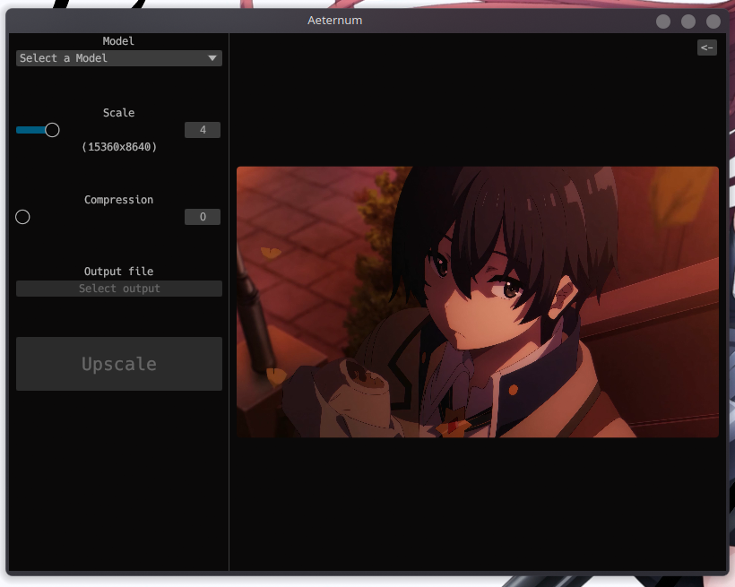

<div align="center">

  # ∞ aeternum
  <sub>A simple and minimal upscaler built in rust (WIP)</sub>

  

  <sub>(Image from a **WIP** development build, the final product may differ.)</sub>
</div>

> [!CAUTION]
> This project is HEAVILY a work in progress. Github issues are very welcome. 🤝

# What is Aeternum?
Aeternum (lt.: "Eternal") is a simple, minimal but yet feature-rich image upscaler using [`upscayl-ncnn`](https://github.com/upscayl/upscayl-ncnn) as it's backend.
Aeternum is built using [`rust`](https://www.rust-lang.org) and [`egui`](https://github.com/emilk/egui).

# 🛠️ Installation
WIP

## 🏗 Build from source
### Prerequisites:
- [Rust](https://www.rust-lang.org/tools/install) and Cargo (Rust **`1.81.0`**+ is required!).
- [upscayl-ncnn](https://github.com/upscayl/upscayl-ncnn)

- Linux dependecies for [eframe](https://crates.io/crates/eframe):
  - [libxcb](https://archlinux.org/packages/extra/x86_64/libxcb/)
  - [libxkbcommon](https://archlinux.org/packages/extra/x86_64/libxkbcommon/)
  - [openssl](https://archlinux.org/packages/core/x86_64/openssl/)

1. Clone the repo.
```sh
git clone https://github.com/cloudy-org/aeternum
cd aeternum
```
2. Pull the cirrus tool kit submodule.
```sh
git submodule update --init --recursive
```

#### ⚙️ For Development
At this stage, for development, you would just run ``cargo run``. If you would like to install it to your system continue ahead to the [next section](#-install-into-your-system).

4. Run dev binary.
```sh
cargo run
```
To run Aeternum in development with an image, append `--` and pass an image path after like so:
```sh
cargo run -- ./tsukasa.jpg
```
To run with verbose debugging, call cargo run with the `RUST_LOG=DEBUG` environment variable:
```sh
RUST_LOG=DEBUG cargo run -- ./tsukasa.jpg
```
```
[2024-12-24T11:14:00Z DEBUG aeternum] Using image: 'tsukasa.jpg'
[2024-12-24T11:14:00Z DEBUG eframe] Using the glow renderer
[2024-12-24T11:14:00Z DEBUG sctk] Bound new global [65] wl_output v4
[2024-12-24T11:14:00Z DEBUG sctk] Bound new global [66] wl_output v4
[2024-12-24T11:14:00Z DEBUG sctk] Bound new global [31] zxdg_output_manager_v1 v3
[2024-12-24T11:14:00Z DEBUG sctk] Bound new global [10] wl_seat v7

... (truncated for the sanity of this readme)
```

#### 🎀 Install into your system.
Soon™
